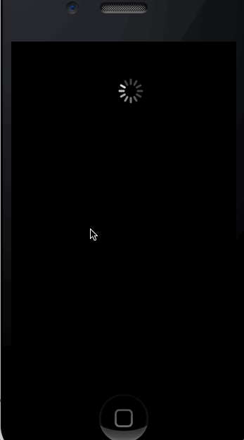

# Sample UICollectionView that supports Infinite-Scroll/Pagination

> By: [@staxmanade](http://staxmanade.com)

Sample/Prototype that demonstrates how you can create an infinite-scroll experience when dealing with (fake) paginated data.

# Inspiration from:

- [UICollectionView tutorial](http://adoptioncurve.net/archives/2012/09/a-simple-uicollectionview-tutorial/) blog post.
- [NSScreenCast Automatic Paging](https://github.com/subdigital/nsscreencast/tree/master/008-automatic-paging)

# Disclaimer

This was my first prototype of the problem. There is probably room for improvement.

EX:

- [ ] Turn into a category and possibly make this more re-usable.

# Demo

